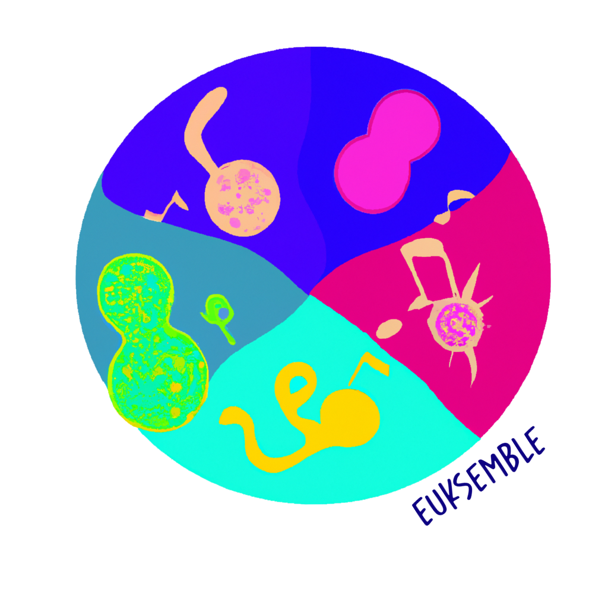
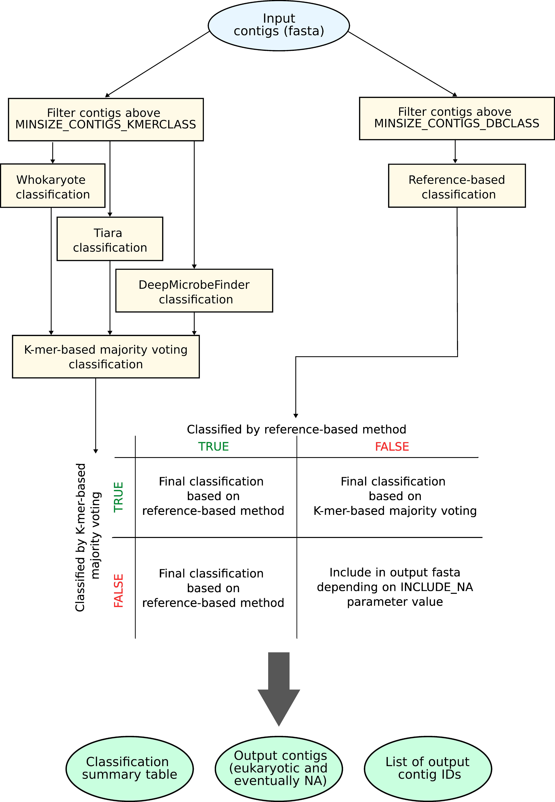

# EUKsemble
Pipeline for identification of eukaryotic contigs in metagenomic assemblies. Best performances are obtained by using an ensemble approach of different k-mer classifiers and a reference-based one.  

This pipeline can run on a desktop computer if Kaiju's predictions are performed on the available webserver. Otherwise around 175GB of RAM are required for this step.

A schematic representation of the steps followed by EUKsemble is present below. 

## Requirements
The following dependencies environments are required (the user can specify the name of a conda environment name for each tool):
- Seqkit (https://bioinf.shenwei.me/seqkit/)
- Tiara (https://github.com/ibe-uw/tiara/blob/main/docs/detailed-installation.md#detailed-installation) 
- Whokaryote (https://github.com/LottePronk/whokaryote#installation)
- DeepMicrobeFinder (https://github.com/chengsly/DeepMicrobeFinder#installation)
- R

And depending on which reference-based classifier is chosen:
- Kaiju (https://github.com/bioinformatics-centre/kaiju, either locally or using the webserver results)
- CAT (https://github.com/dutilh/CAT#installation)

The R scripts used will automatically install (if not present) the packages used:
  - readr
  - dplyr
  - tidyr
  - Taxonomizr (only if Kaiju predictions are performed on the webserver)

Beware that Taxonomizr will require to download a large database on its first usage

## Important parameters and usage 
### Most important parameters
To use `EUKsemble` these are the parameters to be changed: 
- Details on assembly to be classified:
	- `FOLDER`: folder contaning the contigs file
	- `DATA`: name of the contigs file
	- `FILE_EXT`: extention of the contigs file. It has to include the `.` (e.g., `.fasta`)
	- `DB_CLASSIFIER`: selection of either CAT or Kaiju as reference-based tool
- Minimum contigs length to be classified by k-mer-based majority (`MINSIZE_CONTIGS_KMERCLASS`) and refernce-based approches (`MINSIZE_CONTIGS_DBCLASS`). The length is intended in bp (e.g., 1000 = 1 kbp). 
The minimum length can be different between the strategy to exploit the higher confidence of Kaiju's classification with short contigs. For this reason `MINSIZE_CONTIGS_KMERCLASS` needs to be equal or greater than `MINSIZE_CONTIGS_DBCLASS`.
- Whether to include non classified contigs in the output fasta (`INCLUDE_NA`). This choice depends is left to the user as it depends on the specific workflow and the following amount of refinement. 
Our benchmark shows that while the vast majority of prokaryotic contigs at 1 kbp are classified by reference-based tools, only about half of the eukaryotic ones are, meaning that the non-classified contigs might include a large fraction of eukaryotic contigs. 
- Paths to conda environments and binaries

### Usage
1. Specify all variables including assembly name and location, minimum size required for Kaiju's and k-mer eukaryotic classification and the details regarding the location of the dependencies in `EUKsemble-CONFIG.conf`. \
2. Then execute `./EUKsemble.sh EUKsemble-CONFIG.conf`

By default the results are saved in a subfolder next to the classified assembly called `{Assembly name}_EUK_classification/`, where `{Assembly name}` is the name of the assembly to be classified. This behaviour can be changed in the `OTHER PARAMETERS REGARDING OUTPUT AND CLASSIFIERS` section of the config file.

N.B.: In case the prediction is carried out on Kaiju's webserver the pipeline has to be run twice: once, to prepare the files, and then after obtaining the contigs predictions provided by the webserver. 

## Output
By default `EUKsemble` will create a folder alongside the file containing the classified contigs (can be changed editing `RESULTS_FOLDER`). This folder will contain:
- Four folders containing the results of the single tools (e.g., `deepmicrobefinder-results_min3000bp`, `{KAIJU/CAT}-results_min1000bp`,`tiara-results_min3000bp`,`whokaryote-results_min3000bp`). The folder of k-mer-based tools might large as they include the contig files classified by each tools which might be removed if not necessary.
- Two or four files containing the contigs longer than specified and the list of contigs IDs. The name of these files will start as specified in `DATA` followed by the minimum length of the included contigs (e.g., `DATA_min3000bp`)
- One tabular file with the classification results of all the tools on each contig named `DATA.Classification_details_Kmer_minXXXXbp_{kaiju/CAT}_minYYYYbp.tsv` (`DATA` depends on the input provided as well as the minimum contig lengths). This file will contain 9 columns containing the contig ID, the classification by all the tools, the number of k-mer-based classification and the fraction of EUK votes and the majority voting result (either with or without including the reference-based method selected).
For a normal usage the final result is included in the column `MajorityKmer_{kaiju/CAT}_class` which indicates the classification based on Kaiju or CAT and k-mer-based majority voting.
- A text file containing the list of contigs selected as eukaryotic (including `NA` if specified). The file name is `DATA.EUK_contigsIDs_Kmer_minXXXXbp_{KAIJU/CAT}_minYYYYbp.txt` (in case `NA` are included the filename will include `EUK_NA`).
- A fasta file containg the contigs classified as eukaryotic (including `NA` if specified). The file name is `DATA.EUK_Kmer_minXXXXbp_{KAIJU/CAT}_minYYYYbp.fasta` (in case `NA` are included the filename will include `EUK_NA`).

## Citation
Identifying eukaryotes in drinking water metagenomes and factors influencing their biogeography. 
Marco Gabrielli, Zihan Dai, Vincent Delafont, Peer Timmers, Paul van der Wielen, Manuela Antonelli, Ameet Pinto.
bioRxiv 2022.11.29.518372. DOI: https://doi.org/10.1101/2022.11.29.518372 

Also: do not forget to cite the software that made this pipeline possible (look at the requirements).

If you have found this pipeline useful let us know!

P.S.: Thanks to DALL-E (https://labs.openai.com/) for helping with the logo design!

